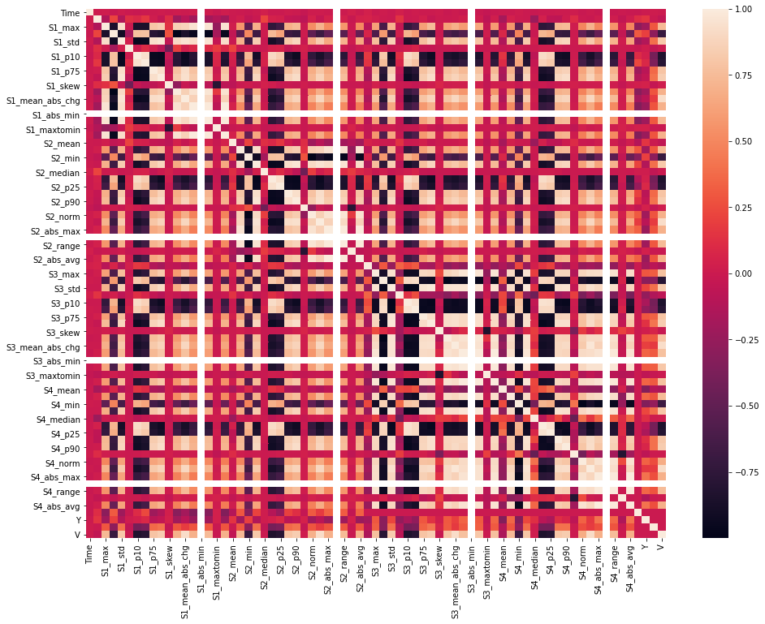

# Collider-detection-AI using Vibration data
DACON Competition | Korea Atomic Energy Research Institute 

### Description:

[https://dacon.io/competitions/official/235614/overview/](https://dacon.io/competitions/official/235614/overview/)

# Winning Solution documentation

---

#### User/Team name: IME

#### LB Position: 
    - Public: 4th 
    - Pvt: 7th 

#### Submission date: 17/07/2020


Update: a single file with clean code + comments will be uploaded soon 

---

## 1: Library and Data

Use of TF Keras, Pytorch, ....

Read the dataset

```
train_x = pd.read_csv(os.path.join(root_dir, 'train_features.csv'))
train_y = pd.read_csv(os.path.join(root_dir, 'train_target.csv'))
test_x = pd.read_csv(os.path.join(root_dir, 'test_features.csv'))
```

```
train_x.head()
```

### Evaluation Metric

SMAPE  

## 2: Data Cleansing & Pre-Processing

## 3: Exploratory Data Analysis

to be added soon

## 4: Feature Engineering & Initial Modeling

- FE lags on various windows (per sensor) —> 24 additional features + 5 raw = `29 features with shape: (-1, 375, 29, 1)`
- FE pct change+ agg stats for each sensor Si  —> `68 features with shape: (-1, 68)`
    - mean, median, min, max, std, percentiles, skew
    - min/max, norm, mean absolute change, absolute max/min, max to min, absolute average




Tried also but didn't work: 

- interactions between S1, S2, S3, S4
- FFT features
- exponential weighted functions


## 5: Model Tuning & Evaluation

### Model 1 [Keras]

CNN2d, 1 channel with 6 layers + FC head with 3 Dense layers

Parameters:

```
filters = [32, 32*2, 32*4, 32*8, 32*16, 32*32]
kernel = (5,1) 
activation = 'elu' 
padding = 'same'
dropout = 0.2
batch_normalization conv layers = True
batch_normalization dense layers = False
dense units = [512, 128, 16]
```


### Training Scheme (Model 1)

Optimizer: `Adam(LR=0.1) + SWA`  

LR schedule: `Cyclic LR (exp)`

Early stopping callback with patience 50

Batch size = 256

Train one model for Position (XY), one model for Mass (M) & one model for Velocity (V)

Model 1-XY `validation loss = 0.0018968`

Model 1-M `validation_loss=0.0005028`

Model 1-V `validation loss=3.3e-05`

---

### Model 2 [Pytorch]

CNN2d with 2 channels, 6 layers + FC head with 3 Dense layers

Parameters:

```
filters = [16, 32, 64, 128, 256, 512]
kernel = (5,1) 
activation = 'elu' 
padding = 'same'
dropout = 0.2
batch_normalization conv layers = True
batch_normalization dense layers = False
dense units = [512, 256, 128]
```

### Training Scheme (Model 2)

Channel 1: `raw data + white Noise (mean=0, std=0.001)`

Channel 2: `normalized data + white Noise (mean=0, std=0.001)`

Optimizer: `Adam(LR=0.001)`  

LR schedule: `ReduceLROnPlateau`

Batch size: `256`

Train one model for Position (XY), one model for Mass (M) & one model for Velocity (V) using KFold (5 folds)

Model 1-XY `validation loss = 0.00013199864`

Model 1-M `validation_loss = 0.005548691534` 

Model 1-V `validation loss = 0.00179906`

---

### Model 3 [Keras]

CNN2d + MLP concat + FC head

Parameters:

```
filters = [32, 32*2, 32*4, 32*8, 32*16, 32*32]
kernel = (5,1) 
activation = 'elu' 
padding = 'same'
dropout = 0.2
batch_normalization conv layers = True
batch_normalization dense layers = True
dense units = [512, 256]
fc dense units (after concat) = [1024, 512, 128]
```


### Training scheme (Model 3)

Optimizer: `Adam(LR=0.01)`  

LR schedule: `step decay`

Early stopping callback with patience 50

Batch size = 256

Train one model for Position (XY), one model for Mass (M) & one model for Velocity (V)

Model 1-XY `validation loss = 0.000263`

Model 1-M `validation_loss = 0.000038` 

Model 1-V `validation loss = 0.00012` 

---

### Ensemble

```
X Prediction: (Model 1 [XY] + Model 2 [XY] + Model 3 [XY])/3 
Y Prediction: (Model 1 [XY] + Model 2 [XY] + Model 3 [XY])/3 
M Prediction: (Model 1 [M] + Model 2 [M] + Model 3 [M])/3 
V Prediction: (Model 1 [V] + Model 2 [V] + Model 3 [V])/3 
```

### Metric/Loss

KAERI metric

```python
def kaeri_metric(y_true,  y_pred):

    '''
        y_true: dataframe with true values of X,Y,M,V
        y_pred: dataframe with pred values of X,Y,M,V

        return: KAERI metric
    '''
    t1, p1 = np.array(y_true)[:,:2], np.array(y_pred)[:,:2]
    E1 = np.mean(np.sum(np.square(t1 - p1), axis=1) / 2e+04)
      
    t2, p2 = np.array(y_true)[:,2:], np.array(y_pred)[:,2:]
    E2 = np.mean(np.sum(np.square((t2 - p2) / (t2 + 1e-06)), axis=1))

    return 0.5*E1 + 0.5*E2
```

## 6. Conclusion & Discussion

My intention here was to experiment with different frameworks (TF, Pytorch) and make comparisons on the model performance, pipelines etc

I was experimenting with many architectures but at the end I didn't have time to focus on a single one and tune it properly and decide it to 
spend the final days to ensembling. Hence, I picked the best 3 models from the 'experimental pool' to boost my LB scores.

However, to my best of knowledge a single model with proper features and tuned parameters can outperform very complex models with complex features. 
Next steps will be towards that direction. 


### Next steps (that I didn't have time to try during the submission time)

- extract FFT features from various bands & from correlations between them
- Mel spectrograms, MFCC features from spectra
- Kalman filtering
- FE + Feature Selection (To select best features amongst the pool of features)
- Hyperparameter tuning (Weights & Biases)


# Weights & Biases Intro (in case you wish to experiment)

1. Install It 

```python
!pip install --upgrade wandb
```

2. Login from your ID

```python
!wandb login {secret_value_0}
```

3. Intialise your project (and hyperparameters)

```python
import wandb
from wandb.keras import WandbCallback

defaults=dict(
    dropout = 0.2,
    learn_rate = 0.01,
    beta1 = 0.9,
    beta2 = 0.999,
    epsilon = 1e-07,
    label_smooth = 0.1
    )

# Initialize a new wandb run and pass in the config object
wandb.init(project="visualize-models", config=defaults, name="neural_network")
config = wandb.config 
```

4. Add parameters in your model and in compile like this——

```python
with strategy.scope():
    model = tf.keras.Sequential([
        efn.EfficientNetB5(
            input_shape=(*IMAGE_SIZE, 3),
            weights='imagenet',
            include_top=False
        ),
        L.GlobalAveragePooling2D(),
        L.Dense(1024, activation = 'relu'), 
        L.Dropout(config.dropout), 
        ....
    ])
```

```python
model.compile(
    optimizer=tf.keras.optimizers.Adam(learning_rate=config.learn_rate),
    loss = 'binary_crossentropy',
    metrics=['binary_crossentropy', 'accuracy'])
```

5. Add the callback 

```python

history = model.fit(
    get_training_dataset(), 
    epochs=EPOCHS, 
    validation_data=get_validation_dataset(),
    steps_per_epoch=STEPS_PER_EPOCH,
    callbacks=[WandbCallback()]
)
```


